*RPA Week 5 Day 4*

**Recording (Automatic & Manual)**

UiPath Studio allows a user journey to be recorded automatically via the
‘Recording’ option. This feature allows a user to build up an automated workflow
quickly which then acts as a foundation for developing the remaining automation
and including error handling etc.

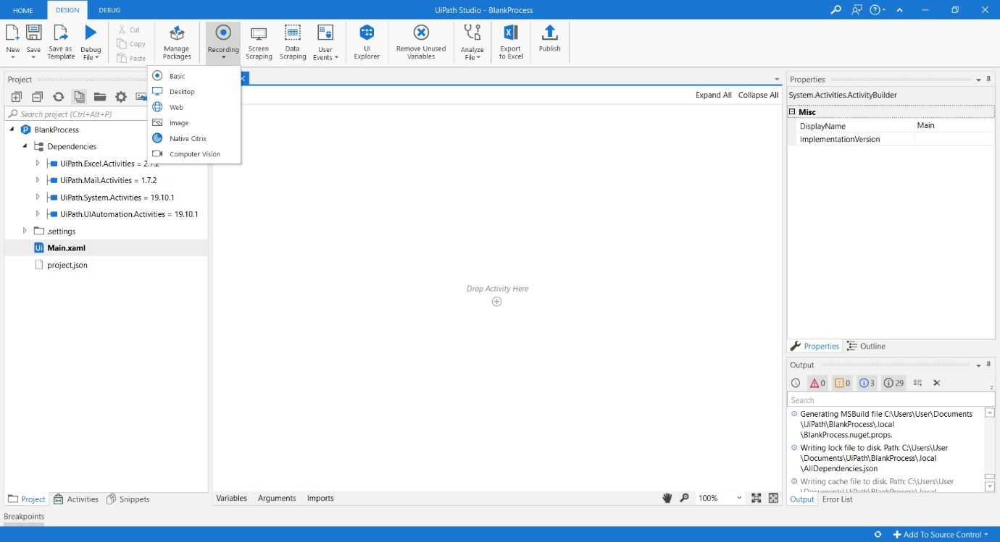

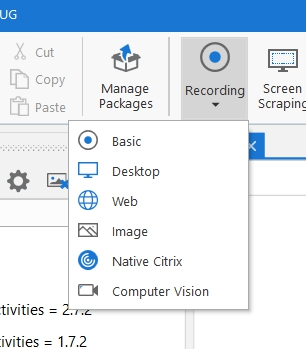

There are 4 main types of Recording:

-   Basic

    -   Creates a very simple sequence with no containers, slow

-   Desktop

    -   Creates a containerised sequence that recognises individual windows and
        attaches them correctly to the automation

-   Web

    -   Very similar to Desktop in terms of structure but designed specifically
        for the demands of Browsers and Web Apps

-   Citrix / Image

    -   Complex OCR functions that will be covered in a later lecture

| UiPath Recorder Capabilities |                    |
|------------------------------|--------------------|
| YES                          | NO                 |
| LEFT clicks on items such as | Keyboard Shortcuts |

-   Buttons

-   Checkboxes

-   Drop Downs

-   Etc.

-   Text Typing

-   Modifier Keys

-   Right Click

-   Mouse Hover

-   etc.

The recording console is presented to the user on selection of the recording
type from the main UiPath Studio interface:

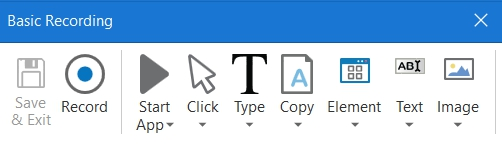

The options displayed are essentially the same, regardless of the type of
recording the user is undertaking. The key functions allow automatic recording
to start/stop/exit but also provide the user with additional tools to assist in
manually recording single action items not recorded natively (see table above).

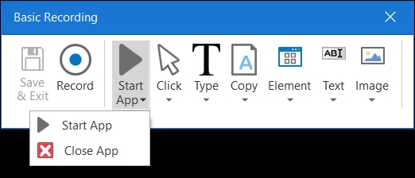

The Start App (Desktop)/ Open Browser (Web) function will build a manual step in
to the automation, launching or closing the specified program.

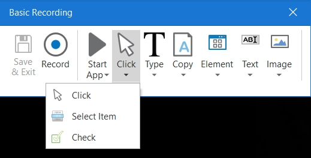

Click allows the user to record clicks on the Desktop or Application, select
options from drop down lists or combo boxes or select radio button options

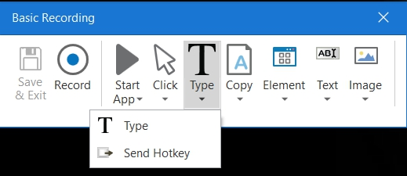

Type provides support for entering text or hotkeys directly

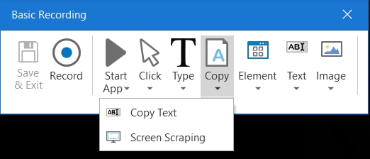

Copy allows for copying text from an application or webpage and making this
available for use later in the automation (normally assigned to a variable)

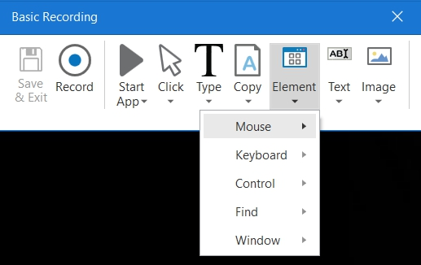

Element activities provide advanced UI interaction:

Mouse: Simulate mouse movements that cannot be recorded

Find: Identify specific UI elements and respond to them

Window: Close windows

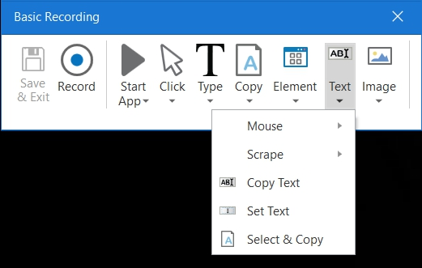

Text single actions allow for the capture of text within tooltips, context
sensitive menus, copy & paste etc.

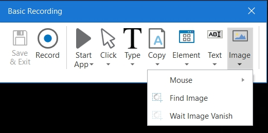

Image single actions allow interactivity with images, waiting for them to
appear/disappear, finding images etc. Works well with graphical images in Web
Apps.

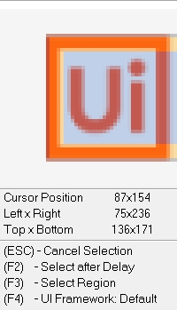

For items that are not natively recorded by the automatic recorder, a stop/start
function is utilised to achieve a complete recording.

Once a recording is started, a monitoring window is displayed providing feedback
on items available for capture and record. This allows the user to (amongst
other things), break out of the recording (ESC) but also to pause briefly then
resume (F2).

For the purposes of this Handout we’ll concentrate on these two functions.

**Cancel Selection (ESC)**

The Cancel Selection function allows the user to exit direct screen recording
without exiting the recording session completely. This means that there is scope
to add additional single actions such as sending a hotkey or copying some text
from the screen before resuming the recording or saving and exiting the
recording. Any actions not recorded natively with the automatic recording
function must be dealt with in this manner. Outside of the recording, the
automation can also be enhanced manually by the addition of further
steps/actions.

**Select After Delay (F2)**

Select after delay allows the user to perform additional steps outside of the
recording before recording resumes. This can be utilised to navigate menu items
to the correct option before recording resumes. Useful for correcting selections
within an automation.
