# RPA Week 6 Day 3
## Overview


Microsoft Excel is a very common application used in all remits of business. Dueto its capabilities and popularity, individual components have been built withinUiPath to interact with Microsoft Excel.
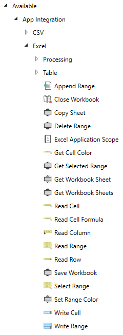
To perform any action with an Excel application, the Excel Application ScopeActivity must be used, and all subsequent Activities to be placed within.
The target excel document can be accessed from the triple dot (…) button fromthe Excel Application Scope Activity, with the default path being relative tothe project’s location. This value can be parameterised.
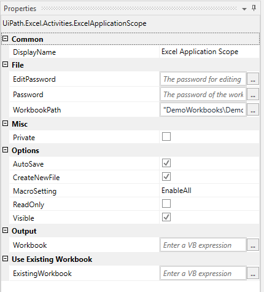
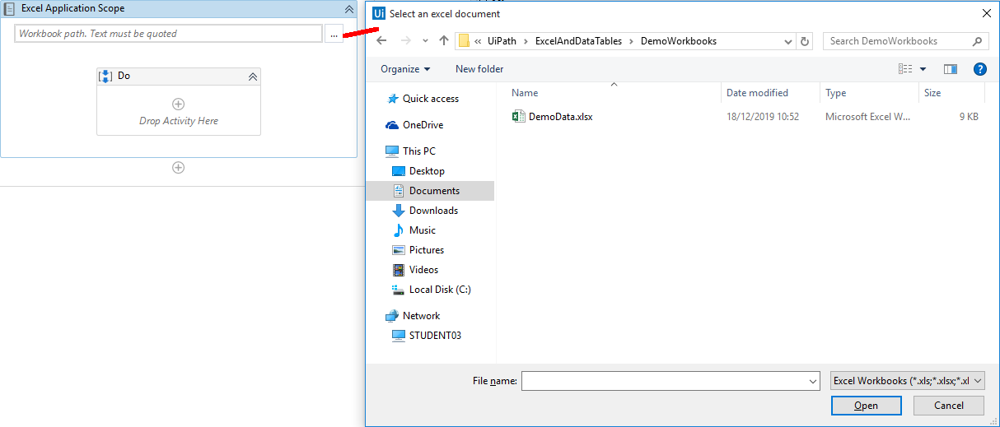
If the file does not exist, one will be created at the given location, with thegiven name, if the CreateNewFile option is checked (it is checked by default).The user is also able to allow or disallow macros from the options too.
The automation can execute Excel activities in the background, if the VisibleOption is unchecked.
The Visible Property option defines whether UiPath will read the file usingMicrosoft Excel (checked), or to perform the read operation internally, directlyon the file (unchecked). UiPath is able to interact with a Microsoft Excel .xlsxfile irrespective of whether the desktop environment has Excel installed or not.
Visible = True (Using Excel):
-   Requires Microsoft Excel to be installed
-   Multiple processes can use the same file concurrently
-   Visible, real-time changes can be observed
Visible = False (Using Direct/Native UiPath):
-   Does not require Microsoft Excel to be installed
-   Only one process can access the file at a time
-   Only works with .xlsx files
-   Can execute as a background activity
Consider the Excel data.
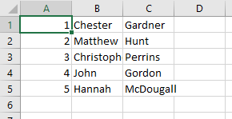
Accessing the data from UiPath requires a Read Range Activity. There are twoentry fields for this activity, the SheetName and the Range – by default the“Sheet1” is used for the sheet name and double quotes is used for the range. Thedouble quotes tells UiPath to capture all data within the sheet provided.Alternatively, the user can specify a range similar to Visual Basic notation,
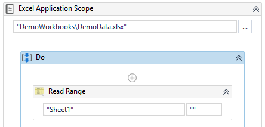
This activity must have an output variable of type DataTable. Headers can beincluded or ignored with the AddHeaders option.
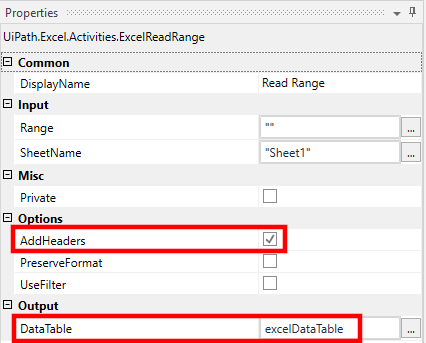
Now that the Read Range Activity has an output variable, that variable must beconverted to a string to be able to display the resulting data capture in aWrite Line Activity. The output for the Read Range Activity should be the inputfor the Output Data Table Activity, and the output for the Output Data TableActivity should be a new string variable.
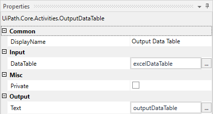
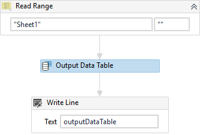
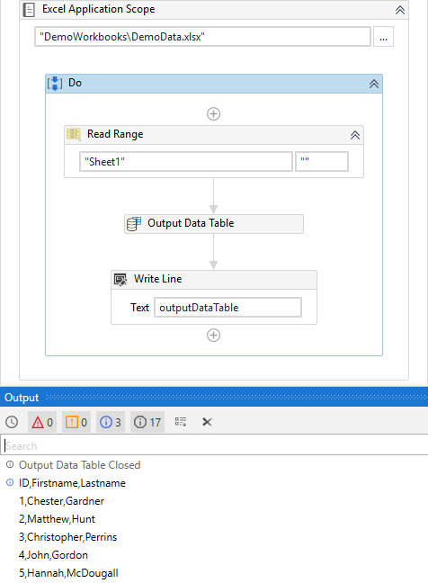
The Write Range Activity works in almost the same way as the Read RangeActivity, with the exception of needing to supply a valid DataTable variable tothe Activity. In the example below, the Excel Application Scope is a differentone from the Read Range Activity. This is because each Excel document beingworked on requires their own Excel Activity Scope for UiPath to be able tointeract with it. If the file already exists and has data within it, UiPath willunbiasedly write the data over the existing data, with the DataTable datasupplied to the Write Range Activity.
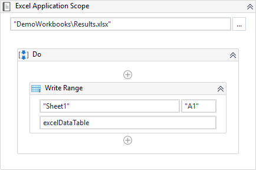
Append Range works similar to the Write Range Activity, with the exception thatit will add the data ## after##  all the currently existing data, and ## notunbiasedly overwrite.
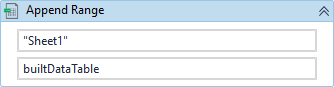
DataTables are a concept within UiPath that work in similar ways to databasetechnologies. Tables can be built, joined, filtered and more. All DataTableActivities can be found under Available -\> Programming -\> DataTable.
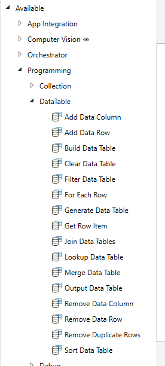
Using the Build Data Table Activity, the user is able to create a database-liketable from within UiPath.
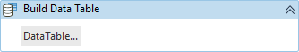
Clicking the DataTable… button, a new dialogue will appear allowing the user toadd or delete rows and columns, as well as edit the column names and row data.
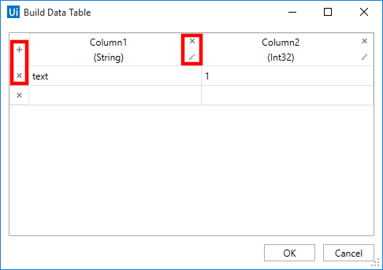
If the user requires a new column, clicking the Plus (+) symbol on the top lefthand corner will present a new display, allowing the user to specify the ColumnName, whether the value is allowed to be Null, the Default Value, if the valueshould be Unique, and a Max Length. If the user sets a Max Length of -1 (bydefault), there is no limit to the number of characters for that field.Furthermore, the user must specify the Data Type for the column. If the DataType is a Int32, the user is able to select whether that value must AutoIncrement, perfect for maintaining unique identifiers for the stored data.
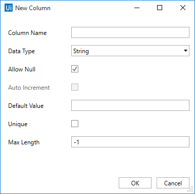
Please note, that if Auto Increment has been selected for an Int32 value, aDefault Value cannot be supplied. The same is true if Unique value has beenchecked.
If the Data Type required is not visible on the drop down menu, the user mayBrowse for Types ….
Please note, that all VB .NET variable types can be used.
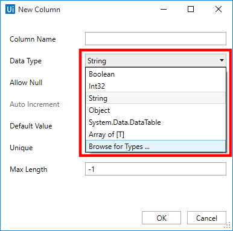
The user is able to reorder the Columns by click, hold and dragging the columnleft or right.
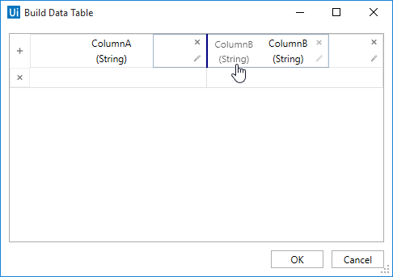
The Build Data Activity must have a DataTable variable to output to.
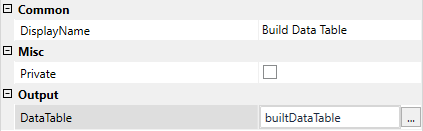
Continuing with the Excel example data above (depicted again below).


Following the above Excel Application Scope Activity a Build Data Table Activitywill be used to create some new data. Following this, a Write Range will writethe data of the original Excel data, and then append the new Build Data TableDataTable Output.
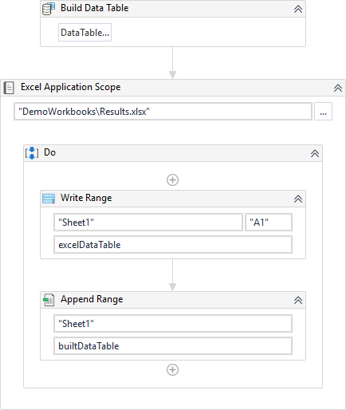
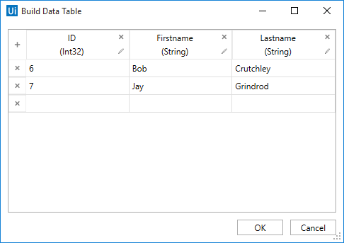
The final output for the Results.xlsx should look like:
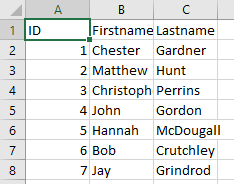
The Sort Data Table Activity allows the user to organise the dataalphanumerically, in ascending or descending order, and can be done on theColumn (which requires a Column Data Type), or more frequently used with anIndex (zero bound) or with robustness in mind, the Name of the column, as itdoes not matter where in the columns index that specific column sits.
The Sort Data Table Activity requires an Input DataTable type and an OutputDataTable type. The Input and Output DataTable can be the same variable.
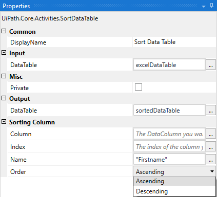
The resulting output should now look like the following.
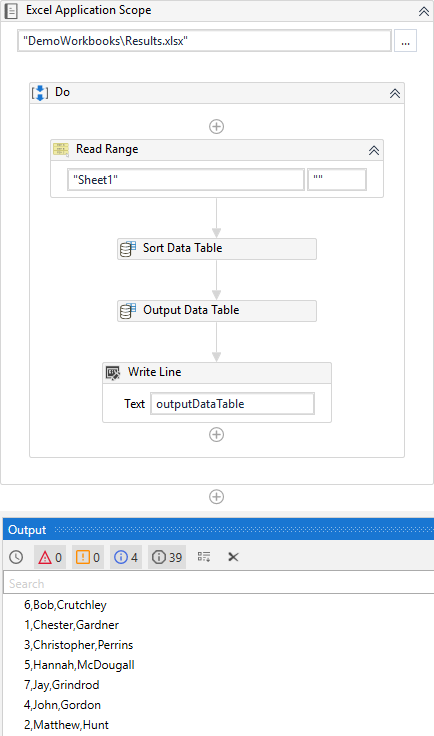
Read Cell Activity reads a specific cell within the target Excel document.
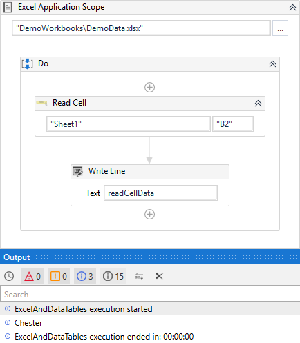
Write Cell Activity places data in to the specified cell within the target Exceldocument.
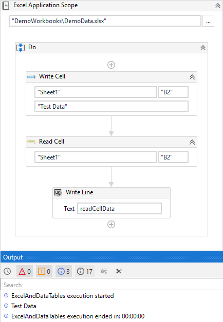
The Select Range Activity quite simply highlights the specified range. Thisactivity does not achieve anything beyond highlighting the desired cells, and isintended for further processing to be achieved (deleting, copying, moving etc).
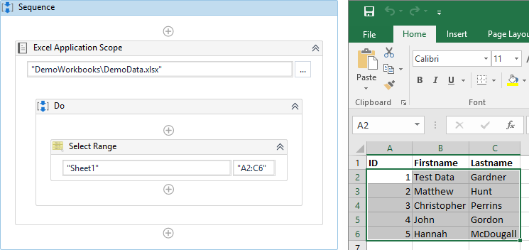
Consider the following Build Data Table Activities, taking note of the datawithin the ID fields in both activities.
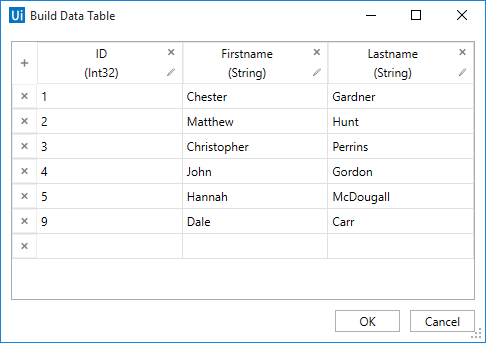
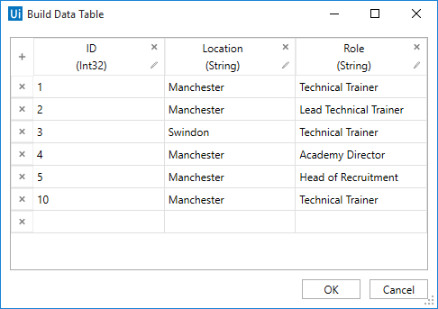
Using a Join Data Tables Activity, the user is able to combine the twoDataTables (in this instance, two was built within UiPath in oppose to scrapingthe data from an Excel document) based on a number of requirements.
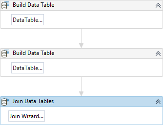
The types of joins that can be achieved are:
-   Inner Join - Select all records from Table A and Table B for which the joincondition is met. All rows that do not match are removed from the resultingtable
-   Left Join - The left join selects records from the first (left-most) tablewith matching right table records. Null values will be inserted into thecolumns for the rows from A that do not have a match in the rows in B
-   Full Join - Used to select all records that match either left or right tablerecords. Null values will be added into the rows from both tables that donot have a match.

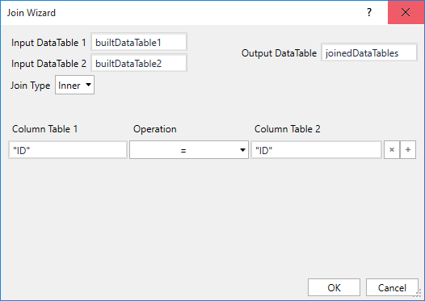
Once the user selects the Join Wizard… button a new dialogue box will presentitself. Input DataTable 1 and 2 must be filled with a DataTable variable, andthe Join Type will need to be changed from the default Inner if another type isrequired. An Output DataTable variable must also be supplied.
Finally, the columns to join on must be provided – as the name of the column forboth DataTables in this instance are called ID, a match will be made over thatfield as depicted below.
If the user requires more columns to make joins with, the plus (+) button on thefar right can be used to add additional conditions.
The result of an Inner Join.
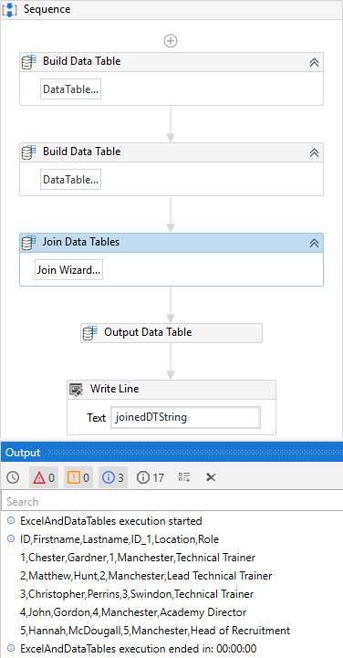
The result of a Left Join. Please note the additional data with NULL fields.
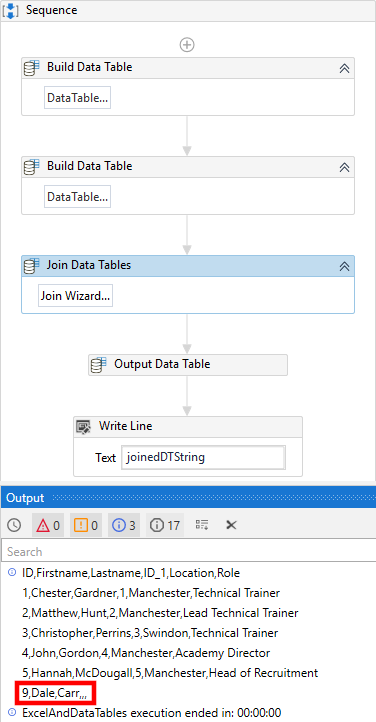
The result of an Full Join. Please note the additional data with NULL fields.
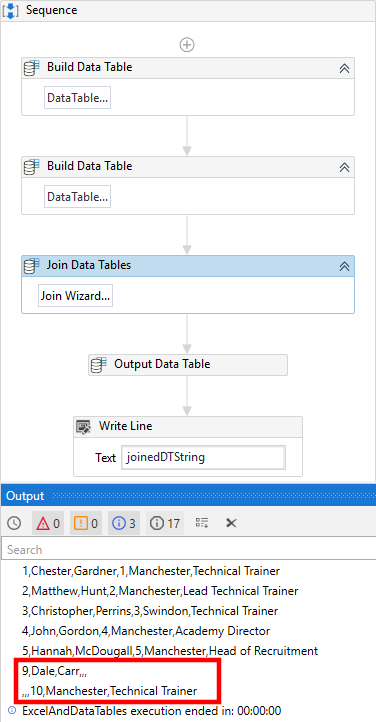
A Filter Data Table Activity allows the user to Keep or Remove data that matchesa specific criteria. The user must suply an Input DataTable and an OutputDataTable. Again, these DataTable variables for input and output can be the samevariable.
Multiple conditions can be set with the AND or the OR operator on the left handside, after adding another condition with the plus (+) button on the right handside of the condition(s).
The below example is looking to identify and keep all data within the DataTablewhose ID is less than 3. Even though the Excel document where the data was takenfrom was a whole integer, UiPath interprets all numeric values read from anExcel document as a Double. Therefore, the Value field should reflect this.Instead of Column ID being less than or equal to "3" it must be set as "3.00".
The Output Columns tab allows the user to specify which of the columns toreturn, if the row data matches the conditions specified on the Filter Rows tab.In this example, all columns need to be returned, and so this tab is left as-is.
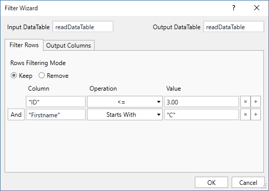
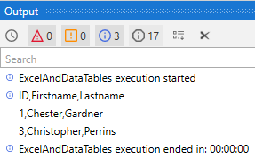
The user is able to add data to a DataTable object by using the Add Data RowActivity, with data being supplied as an ArrayRow or as an actual DataRow.
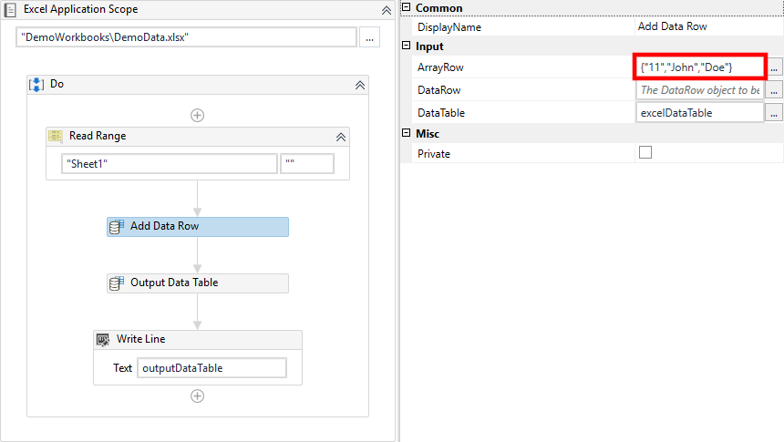
## Tutorial
## Exercises
