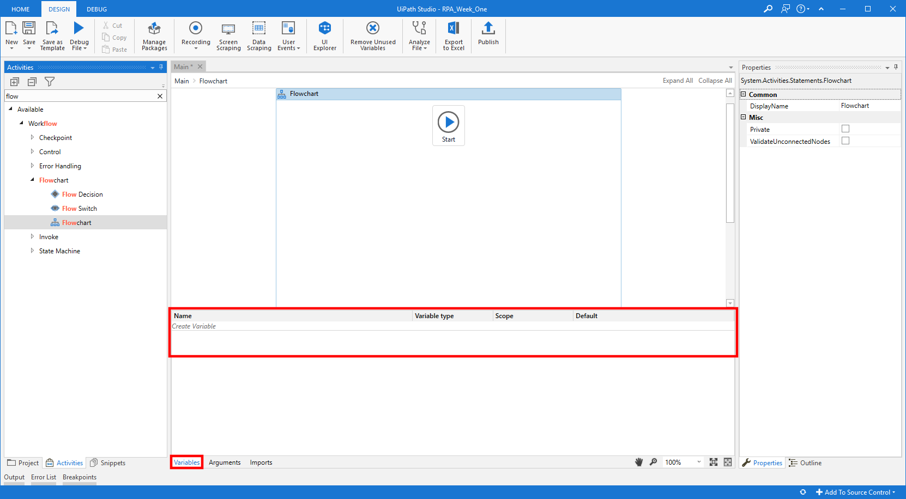
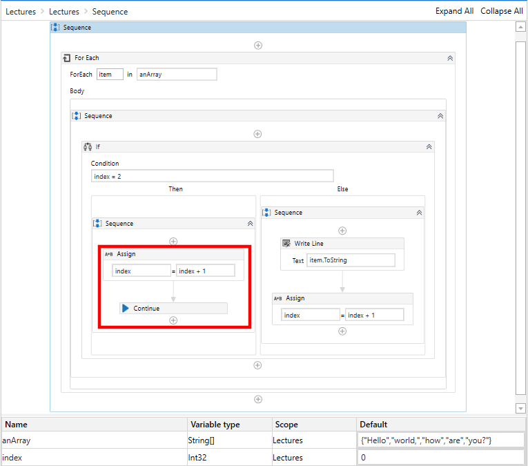

# RPA Week 5 Day 2
## Overview

## Introduction – Variables, Data Types and Control Flow

To utilise UiPath, just as any other language (although UiPath is not actually a
language, it is a working environment with code-like features), variables must
be utilised. The variables pane can be accessed by clicking the variables button
at the bottom of the workspace.



Variables can be created or deleted from this pane. As well as creating a
variable name, a type and scope must be declared. If a numeric integer is
required, under Variable Type select Int32. Similarly, if a String is required,
select String etc.



The scope of the variable will need to be restricted to the activity, or set of
activities, that utilise the variable. If naming conventions are adhered to,
then each activity and sequence of activities must have their own names. Moot
activities which are understandable at a glance can remain as their activity
name(s).



Finally, a default value can be set, but be aware that a default String values
must still be enclosed within quotation marks (“My String Value”). Default
values are optional.



There is the capability of creating a variable ‘on-the-fly’ at any point that
needs to reference a variable. Common places to create a variable on the fly are
within activities such as ‘Assign’, as well as the Properties pane. Creating a
variable on the fly can be achieved by clicking within the reference location,
and pressing the key combination of Control Key + ‘K’. This will create a little
input box with the label ‘Set Var:’. Once this input is filled in, and the Enter
key has been pressed, the variable will be made, and the name of the variable
will automatically be inserted in to the area in which the create variable
endeavour began. Notice that the variable type has been defaulted to
‘GenericValue’.



Generic Values are great when handling simple bits of data, and can store any
kind of data, including text, numbers, dates, and arrays, and is particular to
UiPath Studio. Generic Values can also be automatically converted in to other
types, as required. Ensure that auto-conversions do get taken as they may not
always be converted in to the correct type that you require. When utilising
Generic Values, a good rule of thumb is: The first type used in an expression
will be the conversion end type. For example:

-   Adding a String with an Integer will concatenate the two values;

-   “12” + 34 = “1234 “

-   Adding an Integer with a String will add the numeric values together;

-   34 + “12” = 46

-   Two strings will concatenate;

-   “12” + “34” = “1234”

-   Finally, two integers will naturally be added together

-   12 + 34 = 46



Deleting a variable is as easy as highlighting the variable’s line by single
clicking anywhere on the line, then pressing the delete key. The image below
shows a selected variable.



If the variable type you require is not present on the drop down list of
Variable Types, the user is able to search for other variable types by selecting
Browse for Types….



Click Browse for Types … will open a new dialogue box with a search bar, and
search results. The search results will update as you type, so there is no
necessity to press the Enter key



If the user requires an immutable Array, defining the array contents (Array of
Type) is also required. Any variable type can be housed within an array, and if
the type is not initially depicted in the drop down list, the user will need to
Browser for Types… to locate the correct variable type.



If the user requires there to be default data within the variable declaration of
the array, the curly braces (‘{‘ and ‘}’) must be used, and the data must be
comma separated. If Strings are to be used within the Array, they will still
require the compulsory quotation marks (“String Data”).

If the user requires the use of a mutable list, then the user will have to
Browse for the type, and within the browser, once the correct type has been
selected, will also need to select the data type that will be stored within the
list. Again, this data type can also be Browsed for.



The next Collection is a Dictionary, and must contain a Key and a Value, and the
user must Browse for Type to identify the data type. Once more, the user must
provide a value type for the Key and the Value.



If default values are required within the List and the Dictionary, the variables
must be initialised with utilising .NET code to access the constructor of the
List or Dictionary type class.

For a List, the constructor is:



For a Dictionary, the constructor is:





Another type of collection is a Data Table. Data Tables all UiPath to store rows
and columns of data in a single accessible object. The most common use of a Data
Table is reading from a CSV file, and storing the data contents. The image below
depicts a DataTable variable, storing data from a CSV file, whilst retaining the
header row.



DateTime can be a tricky data type to utilise effectively due to the differing
in Date Time formats across the globe. However, the .NET libraries allow the
user to manipulate the format in to the desired pattern.



The last variable type showcase is a Boolean. A Boolean’s value can only be True
or False, and needs to be stated as such, with a capitalised first letter, NOT
surrounded by quotes, as True and False are both constants within the .NET
language.



Now that Booleans have been described, it is possible to utilise the nature of
the Boolean value, but allowing it to dictate the Flow of Control. For example,
if the variable named “Registered” is False, direct the control to the Register
page, otherwise, direct the control to the Login page. This is known as an If
Statement

If Statements may be conducted at the Flowchart level, or a Sequence. The images
below depict the two methods of utilising an If Statement, in both a Flowchart
and a Sequence.





Please note that the Condition expressed uses a single equals, and is NOT
assigning the value True to booleanValueTrue, it is checking to see whether
booleanValueTrue is in fact a True value. Due to the nature of Booleans, this
Condition can actually be expressed simply as “booleanValueTrue”.



A Switch Statement executes different activities, based on the value of a
variable or the result of an expression. The below example will depict the bare
bones of a Switch Statement, and will elude to the steps in building the Cases.
As it stands, a variable called ‘index’ has been created as an Int32, and has no
default value. This is to dissolve any confusion of what the Default Case is,
and how it is accessed.



Clicking on Add new case, below the word Default, will create an input dialogue,
similar to the creating a variable on-the-fly dialogue. Using a value that the
index can be, in this case if index is 0. Once the name has been entered, the
activity changes to display a pane where the user is able to drag and drop new
activities to.





Note how the activity is labelled next to the Cases in the condensed view. As is
shown, the Default Case has no activity to execute. If there was an activity
within the Default Case, and the index is neither 0 or 1, then the default
activity would be executed. If there is no activity within the Default Case,
then the control flow will go to the next Activity within the Sequence.

Case Switching can also be done within a Flowchart, and follows the same
principles as the Sequence Case Switch. However, accessing the cases may not be
obvious at first glance, and the activities need to be spaced away from the
controlling activity, until the case is unveiled and displayed within a
spherical text label.



Clicking on one of the cases allows the user to either set the output as the
Default, or change the data within the case. Please note that the TypeArgument
must comply with the variable’s type (or the expression must result in the
correct TypeArgument), and all cases must also comply with the TypeArgument
provided.



A While loop will execute a set of activities repeatedly, until an escape clause
has been satisfied. If the escape clause has been satisfied before entering the
loop, then the loop will be skipped, and control will continue to the next
activity. In this example, the escape clause is an index being less than 10,
with an incremental increase of the index, on each iteration of the loop.



Another version of this loop is a Do While loop, which acts in the same manner
as the While loop, except that it will always execute the inner activities at
least once, before checking the condition.



For Each loops will iterate over all the members of an object. In this example,
the collection is a fixed size array. The default name for a *thing* within an
object is called an item, and is named as such within the activity. Any name can
be given here, but please note that the variable called item is a temporary
variable, and will not be accessible outside of the scope of the For Each
activity



For Each Row activities act in the exact same manner as a For Each, except the
object to iterate over must be a DataTable variable type.

Break is a unique activity that will cease the current activity scope execution,
more specifically, it will cease a For Each loop at the point of the Break
activity. Below is an example of a For Each (the same as above) except it has an
If Condition to check what the current index is. If the index reaches 2, break
out from the current code scope. The result is only ‘Hello’ and ‘world’ are
displayed, and not all 5 items of the array.





Similarly, Continue will halt the ## current iteration##  and continue on to the
next iteration. Please note that the index increment must occur before the
Continue activity, or the index will never increase. The output pane will
display 4 of the 5 items within the fixed array.





Lastly, the Delay activity will quite simply halt code execution for a given
amount of time. The activity accepts time in the format of “HH:mm:ss”.


## Tutorial
## Exercises
